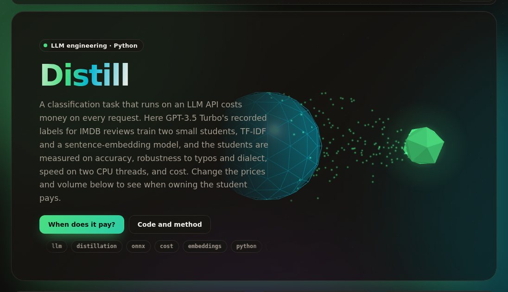

# distill

[](https://umer-78.github.io/distill/)

**Live demo:** https://umer-78.github.io/distill/ (accuracy, learning curve, and a break-even calculator with your own prices)

Distil a frontier model's work on one narrow task into a small model you own, and find the request volume above which owning it beats renting the teacher.

The task is sentiment on real movie reviews (IMDB). The teacher is GPT-3.5 Turbo: its recorded answers come from HELM, including answers to HELM's robustness variants of each review (typos, dialect, swapped names). The student is bge-small (33M parameters, run on CPU through ONNX Runtime) with a logistic-regression head, trained only on the teacher's labels.

## Results

`python -m distill bench`: 215 held-out test reviews (plus their 580 variants), untouched until the end.

| | Teacher (GPT-3.5 Turbo) | TF-IDF + logistic regression | bge-small + logistic regression |
|---|---|---|---|
| Accuracy on test reviews | 95.3% | 85.1% | **94.9%** |
| Agreement with the teacher | — | 87.0% | 93.0% |
| Accuracy on test variants (typos, dialect, names) | 95.2% | 84.3% | 92.6% |
| Same student trained on gold labels | — | 84.7% | 94.4% |
| Latency, one request (p50 / p95) | API round trip | 1.2 / 5.7 ms | 71 / 92 ms |
| Throughput, 2 CPU threads | — | 3,678 / s | 12 / s |
| Cost per 1,000 requests | $3.91 | — | — |

- **The bge student keeps nearly all of the teacher's accuracy:** 94.9% against 95.3%.
- **Distillation gave up nothing.** The same student trained on human gold labels scores 94.4%.
- **It is a little less robust.** On typo and dialect variants it loses 2.3 points, where the teacher loses almost none.
- **TF-IDF is 300 times faster but 10 points worse.** Two configurations, one real trade-off.
- **About 50 labelled reviews get the student to 92.6%.** Past 200 it flattens:

| Training reviews (with variants) | 25 (91) | 50 (185) | 100 (355) | 200 (729) | 400 (1,457) | 571 (2,081) |
|---|---|---|---|---|---|---|
| Accuracy | 88.8% | 92.6% | 93.0% | 94.0% | 94.4% | 94.9% |

**Break-even.** Renting means the teacher at list price ($1.50 / $2.00 per million tokens). Owning means the bge student on as many 2-vCPU machines as the peak rate needs, at $0.089 an hour. The traffic is sized for 3× the average rate, and the one-off labelling cost is spread over a year.

| Requests per month | Teacher | Student |
|---|---|---|
| 10,000 | $39 | $66 |
| 100,000 | $391 | $66 |
| 1,000,000 | $3,911 | $66 |
| 10,000,000 | $39,108 | $66 |
| 100,000,000 | $391,077 | $652 |

**Owning is cheaper above 16,865 requests a month.**

- That uses the teacher's measured prompt, which averaged 2,606 tokens because HELM included five worked examples.
- The break-even is simply the student's fixed cost (about $66 a month) divided by the teacher's price per request.
- With a zero-shot prompt of about 1,000 tokens, it would be roughly 44,000 requests a month; at 500 tokens, about 88,000.
- Labelling the whole training set with the teacher cost $8.14 at list price.

**Limits.**

- HELM ran 1,000 reviews. The spec's 5–10k examples would need your own traffic.
- The 8B LoRA student is out of reach here without a GPU. The pipeline, split discipline and break-even model take any student's measured accuracy, speed and hosting price.
- The prices in `distill/prices.yaml` are list prices to check before relying on the dollar figures.

## How it works

- **Data.** The teacher's answers are filtered against the label set (70 "Neutral" or "Mixed" answers were dropped rather than taught) and deduplicated.
- **Split.** Data is split by review before any tuning (60/20/20), so a review's variants never straddle train and test.
- **Tuning.** Regularisation is picked on validation *agreement with the teacher*, because production has no gold labels.
- **Measurement.** Latency and throughput are measured on 2 CPU threads, matching the 2-vCPU machine in the cost model (Intel Xeon at 2.1 GHz here).

```bash
pip install -e '.[dev]'
pytest -q
python -m distill bench    # embeds 3,627 texts once (about 10 minutes on 4 cores), then under a minute
python -m distill.demo     # rebuild the live demo's data in docs/
```

HELM's results and the bge-small model (pinned by SHA-256) are downloaded on first use into `~/.cache/distill`; nothing is committed.
